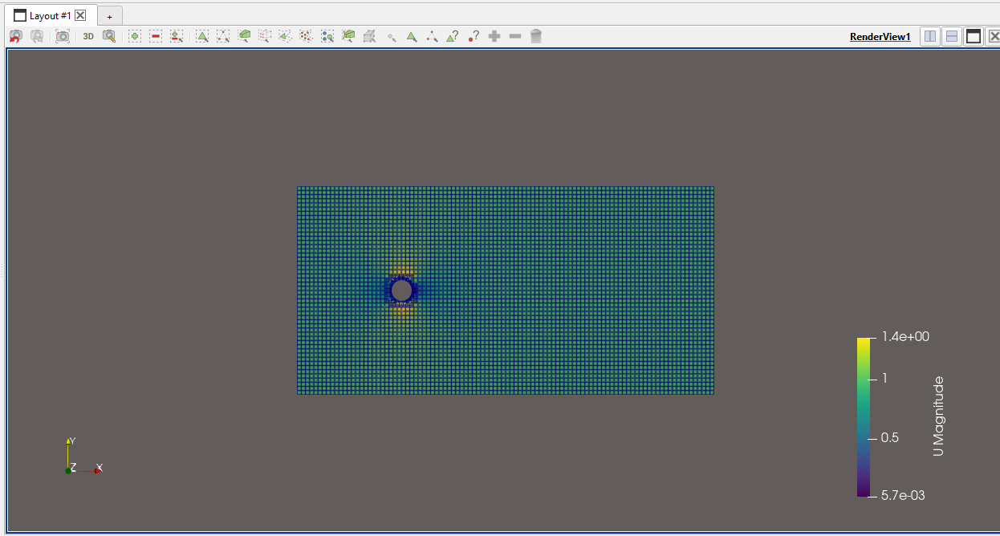
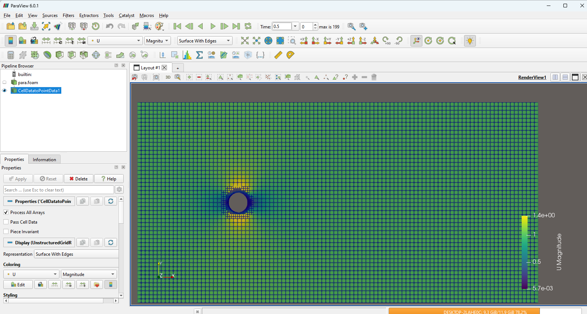
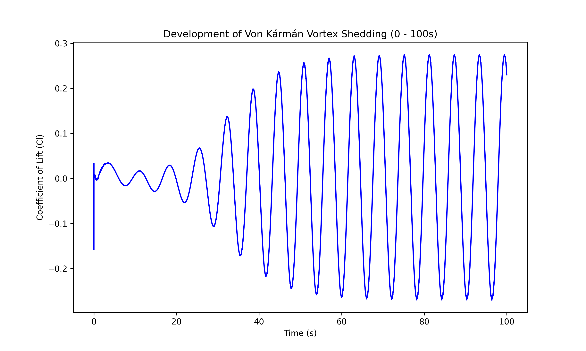
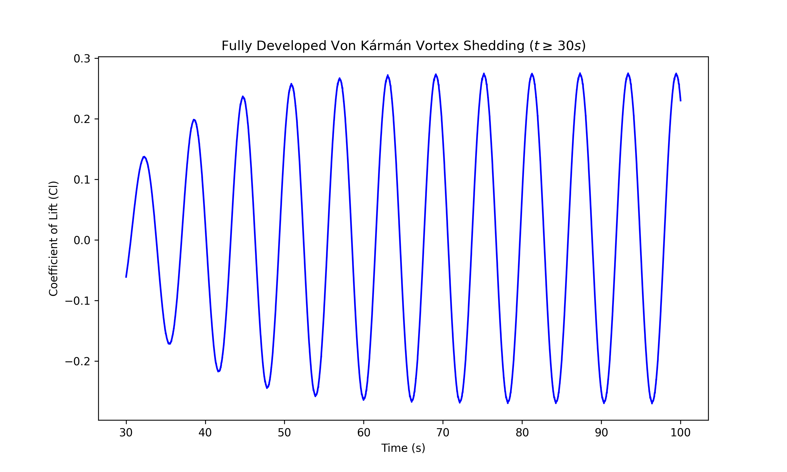
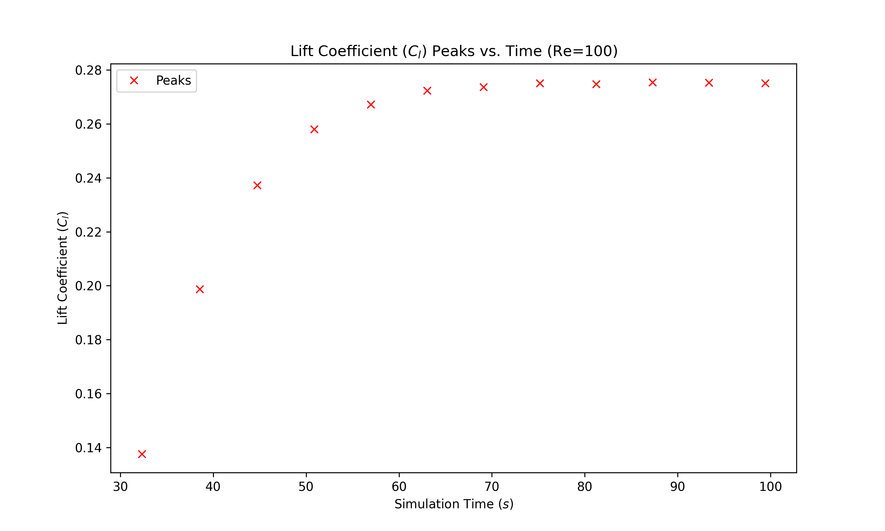
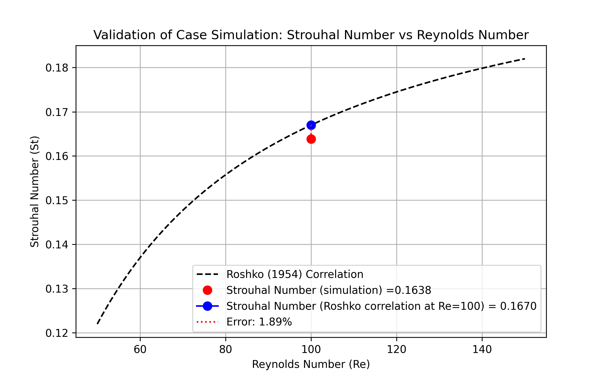

# 2D-Cylinder-Laminar-Vortex-Shedding
This project involves a computational fluid dynamics (CFD) validation study of unsteady laminar flow over a circular cylinder. It illustrates the progression from initial instability to a stable, periodic vortex shedding pattern (Von Kármán vortex street) at Re = 100. 

<div align="center">
  <video src="vortex_shedding_simulation.mp4" width="80%"> </video>
</div>


## Technology used

- **CFD Tool:** OpenFOAM v2312
- **Simulation Environment:**  ParaView
- **Solver:** icoFoam (Transient, incompressible, laminar flow).
- **Meshing:** blockMesh (for background) and snappyHexMesh (for geometry refinement). 
- **MPI:** for parallel processing.
- **Statistical Analysis & Visualization (Python):** numpy, scipy, matplotlib

## Meshing
`snappyHexMesh` was used to refine the grid around the cylinder surface and within the expected path of the Von Kármán vortex street.

<p align="center">
  
  
</p>


## Governing Equations
The fluid flow is modeled as a 2D, unsteady, incompressible laminar flow. The motion is governed by the conservation of mass and momentum equations:
- **Continuity Equation:** $$\nabla \cdot \mathbf{u} = 0$$2. 
- **Momentum Equation:** $$\frac{\partial \mathbf{u}}{\partial t} + (\mathbf{u} \cdot \nabla)\mathbf{u} = -\frac{1}{\rho}\nabla p + \nu \nabla^2 \mathbf{u}$$
Where: $\mathbf{u}$ = velocity vector field, $p$ is the static pressure, $\rho$ is the fluid density, and $\nu$ is the kinematic viscosity.
- **Dimensionless Parameters:** 
The flow regime is defined by the Reynolds Number ($Re$):$$Re = \frac{U D}{\nu}$$
The periodic nature of the vortex shedding is characterized by the Strouhal Number ($St$):$$St = \frac{f D}{U}$$
Where:$f$ is the vortex shedding frequency, $D$ is the cylinder diameter, and $U$ is the freestream velocity.


## Numerical Validation

The simulation was validated by comparing the calculated Strouhal Number ($St$) against the Roshko (1954) empirical correlation for the stable shedding range ($50 < Re < 150$), which is defined by $$St = 0.212 - \frac{4.5}{Re}$$

| Parameter | Value |
| :--- | :--- |
| **Reynolds Number ($Re$)** | 100 |
| **Theoretical Strouhal Number ($St$)** | 0.1670 (Roshko Correlation) |
| **Simulated Strouhal Number** | **0.1638** |
| **Relative Error** | **1.89%** |


## 📂 Repository Structure
```text
├── 0.orig/               # initial Conditions (U, p)
├── constant/             
│   ├── transportProperties
├── system/                   
│   ├── blockMeshDict
│   ├── controlDict
│   ├── decomposeParDict
│   ├── fvSchemes  
│   ├── fvSolution 
│   ├── meshQualityDict 
│   ├── PDRblockMeshDict          
│   └── snappyHexMeshDict
├── .gitignore
├── Allclean
├── Allrun            
├── cylinder_mesh_view01.png 
├── cylinder_mesh_view02.png
├── LICENSE
├── lift_coefficient_peaks_re100.png
├── para.foam
├── README.md
├── requirements.txt 
├── validation_plot.png 
├── vortex_all_timesteps.png
├── vortex_fully_developed.png
├── vortex_shedding_postprocessing.py
└── vortex_shedding_simulation.mp4  
```

##  How to Run

**Prerequisites**
* OpenFOAM v2312 (or compatible)
* ParaView
* Python 3.x

### 1. Clone the repository
```bash
git clone https://github.com/Oluwatobi-coder/2D-Cylinder-Laminar-Vortex-Shedding.git
cd 2D-Cylinder-Laminar-Vortex-Shedding
```

### 2. Run the simulation
```bash
bash ./Allrun # or just ./Allrun
```
## 3. download required libraries for (post-processing script)
```bash
pip install -r requirements.txt
```

## 4. Run post-processing script
```bash
python vortex_shedding_postprocessing.py
```

**Note:** to make the solver run much faster, confirm the number of cores on your computer and update the `numberOfSubdomains` in the `decomposeParDict` file under `system` directory.

## Results

* **Initial and fully developed flow regime:**
The vortex shedding showed an initial instability until $t=30$ s, at which point the flow began to exhibit periodicity.
<p align="center">
  
  
</p>

* **Lift coefficient peaks and Validation plot:**
The peaks increased progressively from $t = 30$ s before reaching a steady state around $t = 70$ s, which maintained until the end of the simulation. The results show strong agreement with the Roshko (1954) correlation, yielding a relative error of only 1.89%.
<p align="center">
  
  
</p>


## 📚 References
Roshko, A. (1954). On the development of turbulent wakes from vortex streets (NACA Report 1191). National Advisory Committee for Aeronautics. https://ntrs.nasa.gov/citations/19930092207
