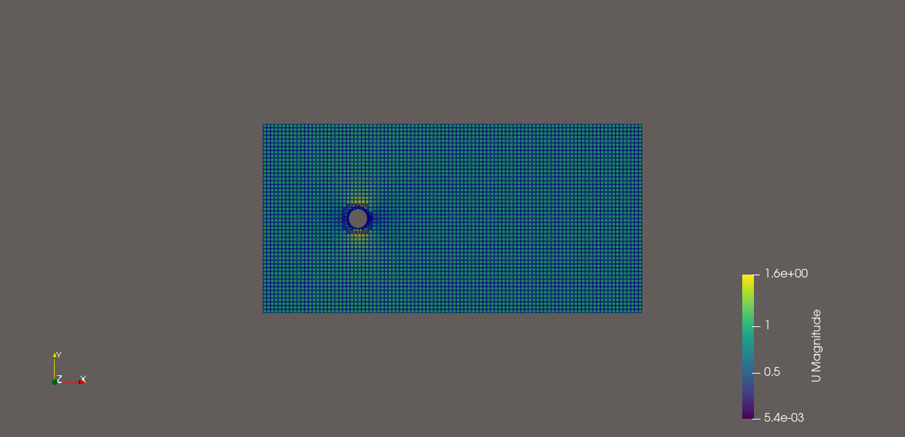
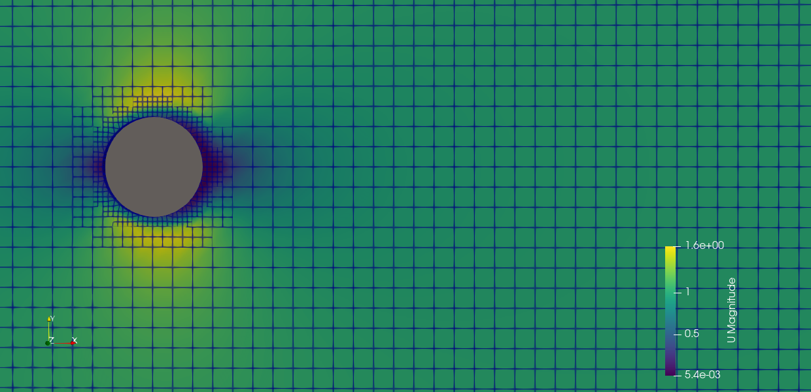
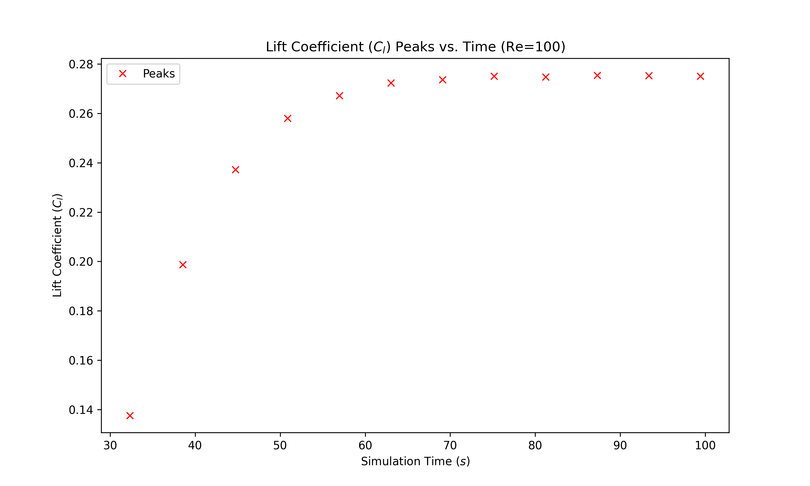

# 2D-Cylinder-Laminar-Vortex-Shedding
This project involves a computational fluid dynamics (CFD) validation study of unsteady laminar flow over a circular cylinder. It illustrates the progression from initial instability to a stable, periodic vortex shedding pattern (Von Kármán vortex street) at Re = 100. 

## Project Overview
This study serves as a foundational validation for the physics of vortex shedding, which is essential for managing thermal loads in power systems and capturing energy from fluid-structure interactions.


## Technology used

- **CFD Tool:** OpenFOAM v2312
- **Simulation Environment:**  ParaView
- **Solver:** icoFoam (Transient, incompressible, laminar flow).
- **Meshing:** blockMesh (for background) and snappyHexMesh (for geometry refinement). 
- **MPI:** for parallel processing.
- **Statistical Analysis & Visualization (Python):** numpy, scipy, matplotlib

## Cylinder Geometry and Boundary Conditions

1. Cylinder Geometry
- Diameter ($D$) = 1.0m

2. Boundary Conditions
- Velocity ($\mathbf{u}$): $1.0 \ \text{m/s}$ in +ve x-direction (Inlet)
- Pressure ($p$): $0 \ \text{Pa}$
- Kinematic Viscosity ($\nu$): $0.01$ $m^2/s$


## Meshing
`snappyHexMesh` was used to refine the grid around the cylinder surface and within the expected path of the Von Kármán vortex street.

<p align="center">
  
  
</p>


## Governing Equations
The fluid flow is modeled as a 2D, unsteady, incompressible laminar flow. The motion is governed by the conservation of mass and momentum equations:
- **Continuity Equation:** $$\nabla \cdot \mathbf{u} = 0$$ 
- **Momentum Equation:** $$\frac{\partial \mathbf{u}}{\partial t} + (\mathbf{u} \cdot \nabla)\mathbf{u} = -\frac{1}{\rho}\nabla p + \nu \nabla^2 \mathbf{u}$$
Where: $\mathbf{u}$ = velocity vector field, $p$ is the static pressure, $\rho$ is the fluid density, and $\nu$ is the kinematic viscosity.
- **Dimensionless Parameters:** 
The flow regime is defined by the Reynolds Number ($Re$): $$Re = \frac{U D}{\nu}$$
The periodic nature of the vortex shedding is characterized by the Strouhal Number ($St$): $$St = \frac{f D}{U}$$
Where: $f$ is the vortex shedding frequency, $D$ is the cylinder diameter, and $U$ is the freestream velocity.

Note: $f$ is a critical factor in the design of bladeless wind/hydro harvesters that utilize flow-induced vibrations for energy generation.


## Numerical Validation

The simulation was validated by comparing the calculated Strouhal Number ($St$) against the Roshko (1954) empirical correlation for the stable shedding range ($50 < Re < 150$), which is defined by $$St = 0.212 - \frac{4.5}{Re}$$

| Parameter | Value |
| :--- | :--- |
| **Reynolds Number ($Re$)** | 100 |
| **Theoretical Strouhal Number ($St$)** | 0.1670 (Roshko Correlation) |
| **Simulated Strouhal Number** | **0.1638** |
| **Relative Error** | **1.89%** |


## 📂 Repository Structure
```text
├── 0.orig/               # initial Conditions (U, p)
├── constant/             
│   ├── transportProperties
├── mesh/             
│   ├── cylinder_mesh_view01.png
│   ├── cylinder_mesh_view02.png
├── post_processing/             
│   ├── vortex_shedding_postprocessing.py
├── results/             
│   ├── lift_coefficient_peaks_re100.png
│   ├── validation_plot.png
│   ├── vortex_all_timesteps.png
│   ├── vortex_fully_developed.png
├── simulation_video/             
│   ├── vortex_shedding_simulation.gif
│   ├── vortex_shedding_simulation.mp4
├── system/                   
│   ├── blockMeshDict
│   ├── controlDict
│   ├── decomposeParDict
│   ├── fvSchemes  
│   ├── fvSolution 
│   ├── meshQualityDict 
│   ├── PDRblockMeshDict          
│   └── snappyHexMeshDict
├── .gitignore
├── Allclean
├── Allrun            
├── README.md
└── requirements.txt 
```

##  How to Run

**Prerequisites**
* OpenFOAM v2312 (or compatible)
* ParaView
* Python 3.8+

## How to Run

### 1. Environment & Path Setup

Clone this repository into your native Linux/WSL home directory.


```bash
# navigate to Linux home and clone the repo
cd ~
git clone https://github.com/Oluwatobi-coder/2D-Cylinder-Laminar-Vortex-Shedding.git
cd 2D-Cylinder-Laminar-Vortex-Shedding

```

### 2. Configuring Parallel Processing

The simulation is pre-configured to run on **2 processors**. To adjust this for your specific hardware:

1. Open `system/decomposeParDict` in a text editor.
2. Update `numberOfSubdomains` to your desired core count.
3. If using `simple` coefficients, ensure the `n` values (e.g., `n (2 1 1)`) multiply to match your `numberOfSubdomains`.

### 3. Execution Workflow

You can run the entire sequence (Meshing, Decomposition, Solving, and Reconstruction) using the automated script:

```bash
chmod +x Allrun
./Allrun

```

Note: During the automated run, solver outputs are redirected to `log.icoFoam`. To monitor residuals in real-time, run `tail -f log.icoFoam` in a separate terminal.

**Manual Execution (Step-by-Step):**
If you prefer to run the steps manually for verification:

```bash
cp -r 0.orig 0                     # Initialize field files
blockMesh                          # Generate background mesh
snappyHexMesh -overwrite           # Refine mesh around the cylinder
decomposePar                       # Partition the domain for parallel run
mpirun -np 2 icoFoam -parallel     # Run solver (update '2' to your core count)
reconstructPar                     # Re-assemble data for visualization

```

### 4. Post-Processing & Visualization

1. **Visualization:** Open the case in ParaView by creating a dummy file:
```bash
touch para.foam && paraview para.foam

```

2. **Statistical Analysis:** Extract the Strouhal Number and Lift/Drag Coefficients using the Python script located in the `post_processing` folder:
```bash
python post_processing/vortex_shedding_postprocessing.py

```

## Results

* **Initial and fully developed flow regime:**
The vortex shedding showed an initial instability until $t=30$ s, at which point the flow began to exhibit periodicity.
<p align="center">
  
  
</p>

* **Lift coefficient peaks and Validation plot:**
The peaks increased progressively from $t = 30$ s before reaching a steady state around $t = 70$ s, which maintained until the end of the simulation. The results show strong agreement with the Roshko (1954) correlation, yielding a relative error of only 1.89%.
<p align="center">
  
  
</p>


## 📚 References
Roshko, A. (1954). On the development of turbulent wakes from vortex streets (NACA Report 1191). National Advisory Committee for Aeronautics. https://ntrs.nasa.gov/citations/19930092207
